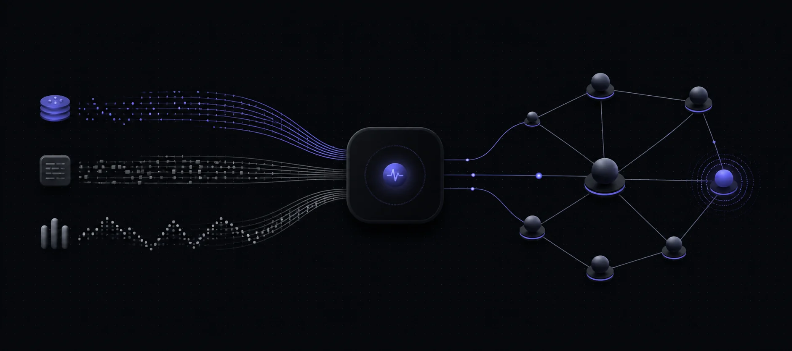

<div align="center">
  

  <h1>OtelContext</h1>

  <p><strong>Turn traces, logs, and metrics into one clear view of your services.</strong></p>
  <p>Self-hosted OpenTelemetry collection, incident triage, and service mapping in one Go binary.</p>

  <p>
    <a href="https://github.com/RandomCodeSpace/otelcontext/releases"></a>
    <a href="https://github.com/RandomCodeSpace/otelcontext/actions/workflows/ci.yml"></a>
    <a href="https://github.com/RandomCodeSpace/otelcontext/actions/workflows/security.yml"></a>
    <a href="LICENSE.md"></a>
  </p>
</div>



OtelContext helps you answer the question that starts most incidents: **what is broken, and what does it affect?** Send it standard OpenTelemetry data and it connects service relationships, errors, latency, logs, and traces in a map built for investigation.

It starts with SQLite and no external services. When you need more, the main telemetry database can use PostgreSQL, MySQL, or SQL Server.

> [!IMPORTANT]
> OtelContext is pre-1.0. Use a published release for a working embedded UI, and read the [changelog](CHANGELOG.md) before upgrading.

## What you get

- **A live service map** that shows dependencies, health, latency, and active anomalies.
- **Incident context in one place** with related traces, logs, metrics, and impact analysis.
- **Seven MCP tools** for investigating your system from an AI client or coding agent.
- **Standard OTLP input** over gRPC and HTTP, so existing SDKs and Collectors can send data directly.
- **A simple first run** with one binary and a local SQLite database.
- **Self-hosted data** with retention controls, health probes, and Prometheus metrics.

## Quick start

### 1. Install a release

Download the archive for your platform from [GitHub Releases](https://github.com/RandomCodeSpace/otelcontext/releases), or install the latest release with Go:

```bash
go install github.com/RandomCodeSpace/otelcontext@latest
```

### 2. Start OtelContext

```bash
otelcontext
```

That is enough for a local trial. OtelContext creates `OtelContext.db`, listens for OTLP gRPC on `4317`, and serves the UI and HTTP endpoints on `8080`.

Open **[http://localhost:8080](http://localhost:8080)**.

Authentication is off by default so the browser UI works immediately. Keep this first run on your machine. Before exposing it to a network, follow [Secure a deployment](#secure-a-deployment).

### 3. Send telemetry

Point an OpenTelemetry SDK or Collector at either endpoint:

| Protocol | Endpoint |
|---|---|
| OTLP gRPC | `localhost:4317` |
| OTLP HTTP | `http://localhost:8080/v1/traces`, `/v1/logs`, or `/v1/metrics` |

To confirm the connection without setting up an application, send one sample error log:

```bash
curl -fsS http://localhost:8080/v1/logs \
  -H "Content-Type: application/json" \
  -d "{
    \"resourceLogs\": [{
      \"resource\": {\"attributes\": [{
        \"key\": \"service.name\",
        \"value\": {\"stringValue\": \"readme-demo\"}
      }]},
      \"scopeLogs\": [{\"logRecords\": [{
        \"timeUnixNano\": \"$(date +%s)000000000\",
        \"severityNumber\": 17,
        \"severityText\": \"ERROR\",
        \"body\": {\"stringValue\": \"OtelContext is receiving data\"}
      }]}]
    }]
  }"
```

ERROR is used because the default storage threshold keeps WARN and ERROR logs.

<details>
<summary><strong>OpenTelemetry Collector example</strong></summary>

Save this as part of your Collector configuration. Replace `otelcontext` with the host or service name running OtelContext.

```yaml
receivers:
  otlp:
    protocols:
      grpc:
        endpoint: 0.0.0.0:4317
      http:
        endpoint: 0.0.0.0:4318

processors:
  batch: {}

exporters:
  otlp/otelcontext:
    endpoint: otelcontext:4317
    tls:
      insecure: true

service:
  pipelines:
    traces:
      receivers: [otlp]
      processors: [batch]
      exporters: [otlp/otelcontext]
    logs:
      receivers: [otlp]
      processors: [batch]
      exporters: [otlp/otelcontext]
    metrics:
      receivers: [otlp]
      processors: [batch]
      exporters: [otlp/otelcontext]
```

For an authenticated deployment, add an `authorization` bearer header and, if needed, `x-tenant-id` under the exporter.

</details>

## Investigate with MCP

Connect an MCP client to `http://localhost:8080/mcp` to investigate the same telemetry from an agent. The tools can:

- Build an anomaly timeline.
- Show the service map and service health.
- Analyze likely root causes and downstream impact.
- Reconstruct a trace graph.
- Search logs with bounded results.

Trace-based answers say whether the supporting exemplar is complete, partial, or no longer retained. OtelContext does not present a partial trace as the whole story.

## Secure a deployment

Set at least one authentication method before exposing OtelContext:

- `API_KEY` for a shared operator credential.
- `AUTH_TRUST_EXTERNAL=true` when a trusted reverse proxy owns authentication and tenant identity.

Example:

```bash
export API_KEY="$(openssl rand -hex 32)"
./otelcontext
```

Clients then send `Authorization: Bearer <key>`. Production mode also requires protected, authenticated gRPC unless you set an explicit waiver.

The browser UI does not currently store an API key. For an authenticated browser deployment, put OtelContext behind a same-origin proxy that authenticates the user and injects the credential for REST, MCP, and WebSocket traffic.

See the [operations guide](docs/OPERATIONS.md) for database, TLS, retention, proxy, and health-check setup.

## Common configuration

OtelContext reads environment variables and an optional `.env` file in its working directory.

| Setting | Default | Use it for |
|---|---|---|
| `HTTP_PORT` | `8080` | UI, REST, OTLP HTTP, MCP, WebSockets, and probes |
| `GRPC_PORT` | `4317` | OTLP gRPC |
| `DB_DRIVER` | `sqlite` | `sqlite`, `postgres`, `mysql`, or `sqlserver` |
| `DB_DSN` | `OtelContext.db` | Database connection string |
| `API_KEY` | empty | Shared bearer authentication |
| `DEFAULT_TENANT` | `default` | Scope used when no trusted tenant is supplied |
| `HOT_RETENTION_DAYS` | `7` | Main retention horizon |
| `STORE_MIN_SEVERITY` | `WARN` | Lowest log severity stored in the main database |
| `AGGREGATE_MODE` | `legacy` | `legacy`, `aggregate-shadow`, or `aggregate` |

Start with [`.env.example`](.env.example). The default `legacy` mode is the right choice for a first run. Aggregate modes are for measured high-volume deployments; review the [aggregate gate report](docs/gates/2026-08-23-aggregate-7day-gate.md) before enabling them.

<details>
<summary><strong>Build from source</strong></summary>

Use the Go version in `go.mod` and Node 24:

```bash
git clone https://github.com/RandomCodeSpace/otelcontext.git
cd otelcontext

npm ci --prefix ui --ignore-scripts
npm run --prefix ui build
CGO_ENABLED=0 go build -o otelcontext .
```

The UI build must run first because the Go binary embeds its output. A plain build from `main` serves the API but not the browser UI.

Run the core checks with:

```bash
go build ./...
go vet ./...
go test -race -timeout 180s ./...

npm test --prefix ui
```

</details>

## Project links

- [Releases](https://github.com/RandomCodeSpace/otelcontext/releases)
- [Changelog](CHANGELOG.md)
- [Operations guide](docs/OPERATIONS.md)
- [Contributing](CONTRIBUTING.md)
- [Security policy](SECURITY.md)
- [Aggregate design glossary](CONTEXT.md)
- [Release gate protocol](docs/gates/README.md)

## License

OtelContext is available under the [MIT License](LICENSE.md).
